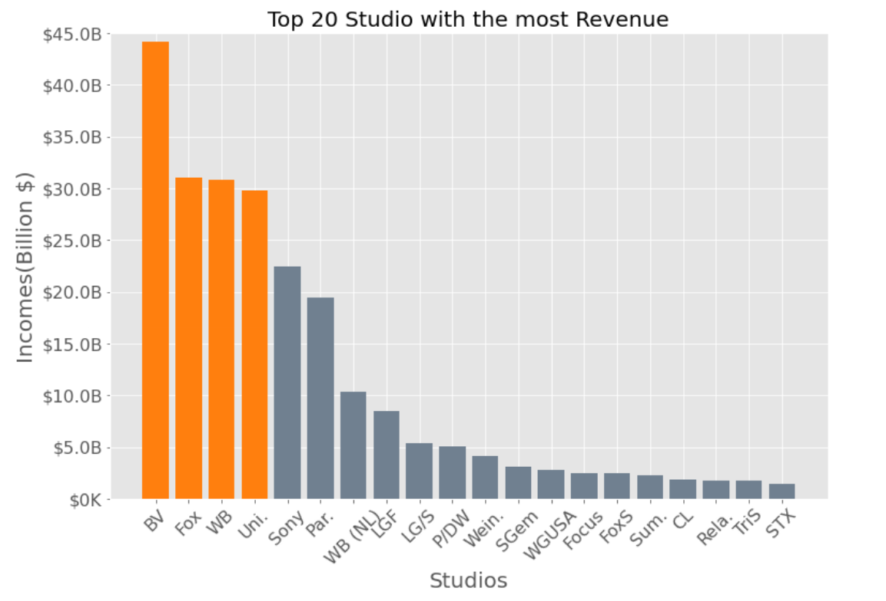
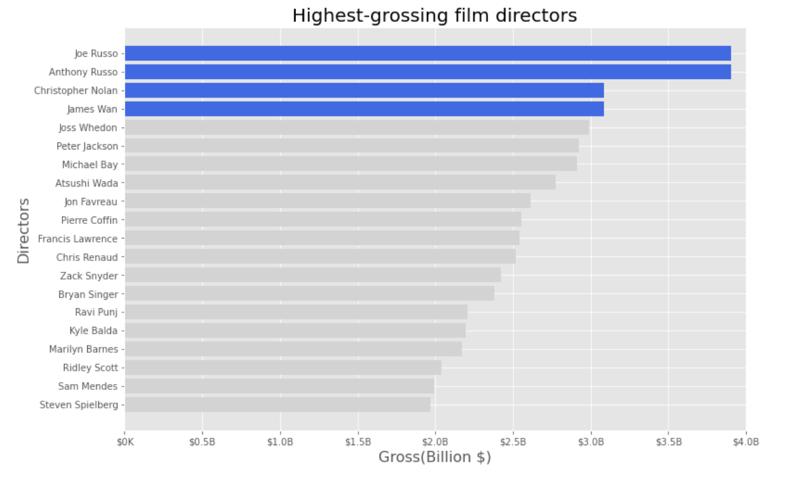
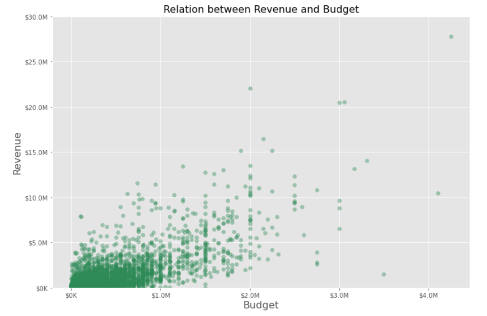

# IMDB Movies Analyze

   This project prepared to analyze imdb movie datasets and give recommendation to new studio to make movie.

## Business Problem

   Microsoft have decided to create a new movie studio, but they don’t know anything about creating movies. In this project you can see 9 different visualizations to easily see what my analyzes are.
   
   Our approach to business problem with this questions;
    
    1. Which studios has the most revenue movies? 
    2. What is the most made type of movies?
    3. Is there a good relation with movie budget and revenue?
    4. Which directors made most revenue and why?

## The Data

   There are 11 different datasets in this project. You can see dataframes at section '2' in student.ipynb.
   
   There is some visual samples from my project;
   
   
   
   
   
   
   

## Getting Started

* My approach to the this problem is looking thru studios at section 3.1, movie types at section 3.2, movie budgets at section 3.3, directors at section 3.4.

* I used 'bom.movie_gross.csv.gz' dataset for looking inside studios. Grouped and created first graph to look top 20 studios with most revenue.

* At the section 3.2 merged 'mdb.title.basics.csv.gz' and 'bom.movie_gross.csv.gz' to looked most made movie types. Also some process of coding to look top 3 studios made movie types.

* Section 3.3 for budget revenue relations(which analyzed positive relation).

* Finally section 3.4 for directors to look at the visualization the highest-gross directors.

## Conclusion

 * We can recommend to new studio to make movie with one of directors;
 - Joe Russo,Anthony Russo or Christopher Nolan,
 - on action,adventure,comedy or drama.
 - give possible budget between 100 million to 300 million. 
 - And further look what BV and Fox studios are doing to have most revenue and become most popular.

## Future Work

For future work if we have 6 more months and more budget to work on this project we could work on;
- On movie names(if they affect audience,ratings,reviews)
- On movie soundtracks
- On regulation/marketing theater dates
- Relations between directors and studios if there is any.

